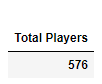
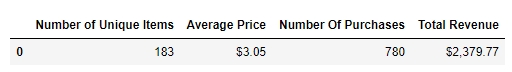
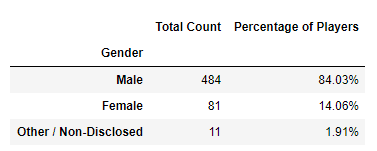
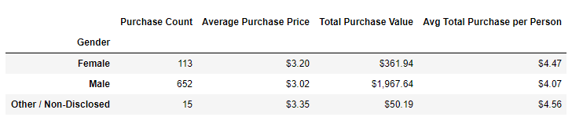
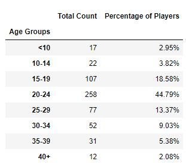
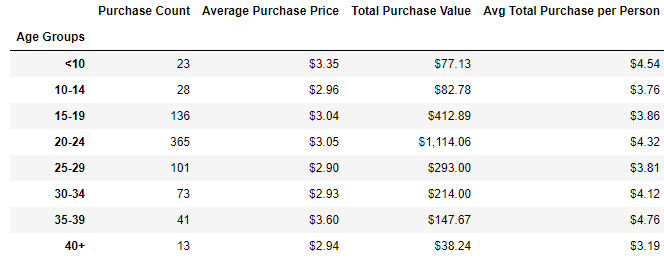
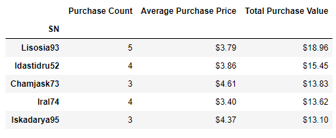
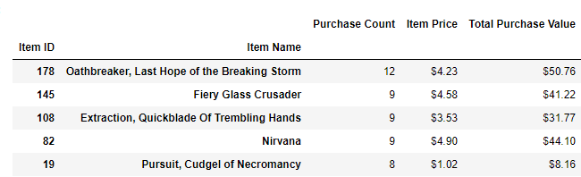
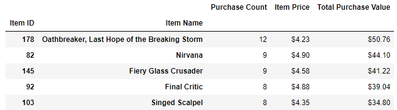

### Heroes Of Pymoli Game Data Analysis
* Of the 576 total players, the vast majority are male (84%). There also exists, a smaller, but notable proportion of female players (14%).

* Our peak age demographic falls between 20-24 (44.8%) with secondary groups falling between 15-19 (18.60%) and 25-29 (13.4%). 
## Player Count

## Purchase Analysis Total

## Gender Demographics

## Purchasing Analysis (Gender)

## Age Demographics

## Purchase Analysis Age

## Top Spenders

## Most Popular Items

## Most Profitable Items

