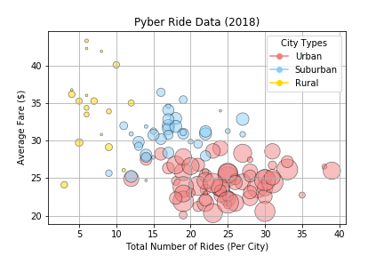
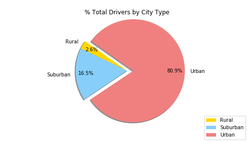
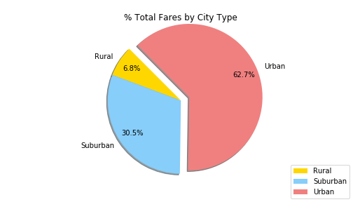
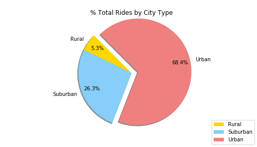

### Observable Trends

* 1. The Rural area has the least of amount of riders on average, and the fare prices have a higher and lower price ceiling than urban areas. If you drive in a rural area, it seems that you would not be able to expect a consistant per day income. This would cause the driver to either have an short, or a long day to make their daily goal

* 2. If you drive in Urban environments, there is a lot of competition and prices are lower than suburban areas. this would cause the driver to work longer hours to pick up more riders to make their daily goal. It seems the average price hot spot for an urban environment is around 22 dollars. With no fares reaching the 30 dollar mark. 

* 3. Suburban environments seem to bring in the most consistent price per ride at a hotspot price of around 30-35 dollars. If the driver planned on working the most consistent hours, and bringing home a consistent income per day, then suburban would be the recommended environment to drive in. There is much less competition in this area than urban, and provides a consistent income per ride than rural. 

### Bubble Plot of Ride Sharing Data

### Total Fares by City Type

### Total Rides by City Type

### Total Drivers by City Type
